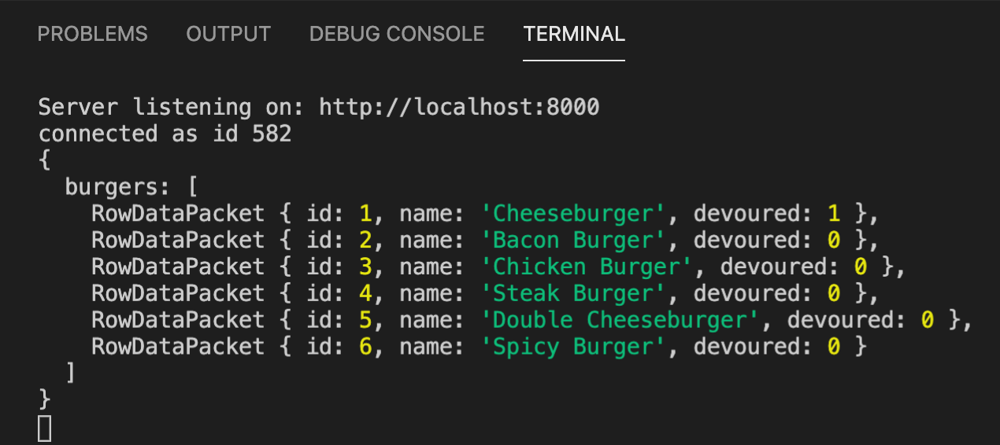

  
  
  
  # EAT-DA-BURGER!
  ### Burger Logger, Homework 11, Unit 13
  ## Description
  #### In this app, we are able to place an order for a burger, devour it, and delete it. Using MySQL, express, handlebars, node.js, and a custom orm, we can access a database of burgers that have been added, devoured, and removed. Burgers on the left side of the window have not been devoured yet, and burgers on the right side of the window have.
  # Table of Contents
   * [Installation](#installation)
   * [Usage](#usage)
   * [License](#license)
   * [Contributors](#contributors)
   * [Tests](#tests)
   * [Questions](#questions)
  ## Installation
  #### npm, handlebars, express, mySQL, bootstrap
  ## Usage
  #### See link below for usage:
  https://drive.google.com/file/d/1_aEUNXF9_FmSXBQwQK07nQvBQRSLvXLu/view
  ### Console.log in bash terminal:
  

  ### MySQL table:
  
  
  ## License
  #### This project is licensed under the MIT license.
  ## Contributing
  #### DU
  ## Test
  #### 
  ## Questions
  #### Email: <a>kanilionis@gmail.com</a>
  #### GitHub: <a>github.com/kanilionis</a>
  